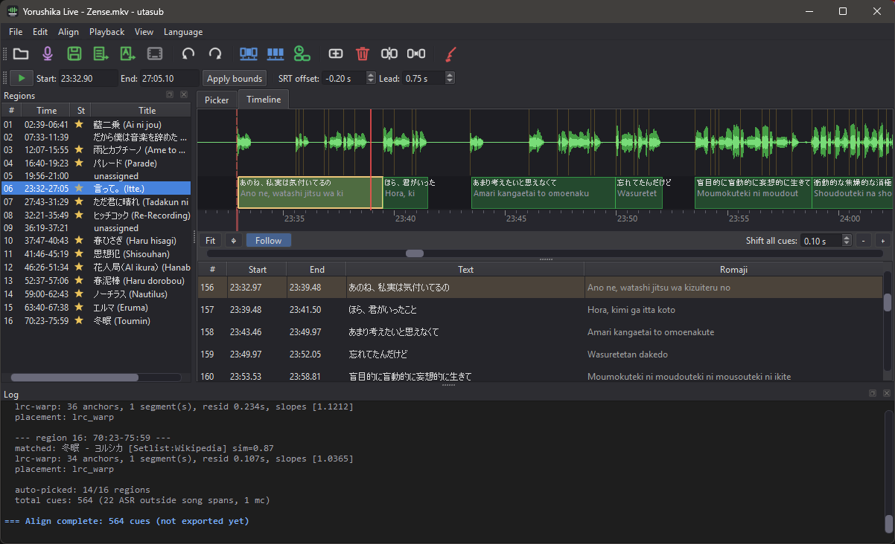
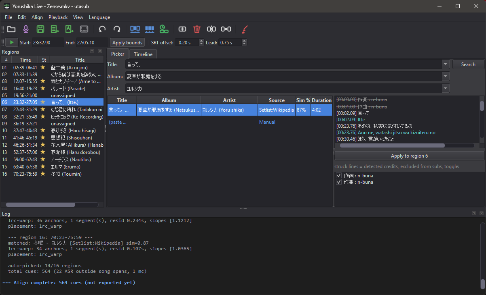

# utasub

<div align='center'>

[](https://github.com/nnyj/utasub/stargazers)
[](https://github.com/nnyj/utasub/actions)

</div>

- Stamps official lyrics onto performance videos, outputs `.srt`/`.ass` subtitles
- Fetches lyrics from NetEase/LRCLib, aligns them to a cached ASR transcript with forced alignment and vocal-envelope snapping
- Timeline GUI for manual fixes, machine proposes, human picks and drags





## Features

- One command per file: `utasub concert.mkv` transcribes when the file has no ASR block, then fetches, aligns and opens the GUI
- Batch targets: files, directories (`--recursive`) and globs, own outputs (`.subbed`, `.vocals`, `.utasub`) skipped, one summary table at the end
- Lyric fetch from NetEase (primary), LRCLib, embedded container tags, and a curated local `.lrc` library
- Candidate ranking against the ASR transcript in romaji space (text + duration similarity)
- Credit-line cleanup via `lyrickit.classify_lines`/`filter_credit_lines`: strikes 作词/作曲/编曲 labels, watermarks, LRC headers
- Placement chain: LRC warp (piecewise tempo map) with coarse + forced-alignment fallback
- Qwen3-ForcedAligner word-level stamping with plausibility gates, still runs without a GPU
- Multi-song mode: region detection from vocal gaps, setlist discovery (Wikipedia) or pasted setlist, order-aware DP matching
- Suspect regions: a weak or near-tied auto-assignment is flagged amber in the region list, tooltip names the runner-up title
- MC detection: spoken intermission talk flagged from transcript text signals, excluded from lyric matching, exported as grey romaji cues
- Junk filter: ASR text invented over crowd noise, cheers and tiled chants dropped before export (`--asr-fill`)
- PySide6 GUI: per-region lyrics picker, `Align > Paste setlist...` re-match, waveform timeline with draggable cues, onset snap, tap-sync, undo/redo
- Conf column per cue with the CTC score, amber below this song's cut, `Alt+N`/`Alt+P` jump between the low-confidence lines
- Keyboard cue editing: `N`/`P` step cues, `Left`/`Right` nudge 10 ms, `Shift` moves the end only, `Ctrl` nudges 100 ms, `Ctrl+Space` plays from the cue, `View > Shortcuts` lists the whole map
- Karaoke `\kf` fill on the sung line, timed from the CTC token spans of the adopted stamp
- `--translation` adds a third `.ass` line from the NetEase `tlyric` already in the fetch cache, matched to the LRC line by timestamp, previewed greyed in the picker
- `File > Export LRC` writes the region's corrected timings back to the curated library as `<artist> - <title>.lrc`, rebased to the region start
- `Playback > Preview in mpv` plays the video with the exported `.ass` from the playhead (needs `mpv` on PATH)
- Deterministic re-export from a session file, no network or re-alignment needed
- Output: `.srt` (plus `.ja.srt`/`.romaji.srt`), styled dual-line `.ass`, mux into `.subbed.mkv` with the `.ass` as the default track and the `.srt` as fallback

## Usage

```sh
utasub concert.mkv                # transcribe if needed, fetch, align, open GUI
utasub concert.mkv --multi-song   # concert with multiple songs
utasub concert.mkv --no-gui       # headless best-effort export
utasub concert.mkv --timeline     # reopen saved session, skip align
utasub lives/ --recursive         # every media file under a tree, summary table at the end
```

- `utasub-asr lives/*.mkv` pre-transcribes a batch ahead of time, writing the ASR block into each `<name>.utasub.json`
- `--no-asr` skips in-process transcription and leaves a file without an ASR block untouched
- `utasub.bat` accepts drag-and-drop and runs `--no-gui`

## CLI flags

- Positional targets: media files, directories or globs, omit them to open the GUI empty

| Flag | Default | Description |
| ---- | ------- | ----------- |
| `--gui/--no-gui` | auto | GUI when a display is available |
| `--recursive` | off | descend into subdirectories of a directory target |
| `--multi-song` | off | region detection + per-song matching |
| `--asr/--no-asr` | on | transcribe in-process when the file has no ASR block |
| `--asr-fill/--no-asr-fill` | on | keep transcript outside song spans as cues, junk filtered |
| `--providers` | `NetEase` | comma-separated lyric sources |
| `--fa/--no-fa` | auto | forced alignment, on when `torchaudio` or `qwen_asr` importable |
| `--romaji/--no-romaji` | on | romaji subtitle track |
| `--lang` | `auto` | lyric language for romanization: `auto`, `jp`, `cn`, `kr` |
| `--setlist/--no-setlist` | on | setlist discovery in multi-song mode |
| `--setlist-file` | none | manual setlist text file, overrides discovery |
| `--mc/--no-mc` | on | detect spoken MC talk, exclude from matching, subtitle it as grey romaji |
| `--timeline` | off | open saved session directly, skip align |
| `--fresh` | off | bypass fetch cache |
| `--offset` | `-0.2` | SRT offset seconds, negative = earlier |
| `--lead` | `0.0` | extra head start seconds |
| `--ass-font` | `Arial` | `.ass` font name |
| `--ass-size` | `72` | `.ass` font size, PlayRes px |
| `--ass-outline` | `3` | `.ass` outline thickness |
| `--ass-box` | off | opaque box behind the text (BorderStyle 3) |
| `--ass-pos` | `2` | subtitle position: 2 bottom, 8 top |
| `--translation/--no-translation` | off | third `.ass` line from the candidate's translated lyrics |

- `utasub-asr` flags: `--lang` (force language), `--small` (0.6B model), `--cpu`, `--no-stems` (transcribe full mix), `--overwrite`

## Alignment

- Inputs:
  - Qwen3-ASR transcribes the vocal stem, cached in `<name>.utasub.json`.
  - Lyrics come from NetEase, LRCLib, embedded tags, or the local library.
  - Candidates are scored against romanized ASR text after credit removal.
  - Multi-song mode detects vocal regions and matches setlist order with dynamic programming.

- LRC warp:
  - Global CTC alignment uses torchaudio MMS_FA to stamp ordered lyric tokens across each song.
  - `<star>` tokens absorb intros, instrumentals, and speech between lyric lines.
  - Emissions use 30 s chunks with 1.5 s context, concatenated for one alignment pass.
  - Ordered stamps can still be misplaced, the linear anchor filter rejects implausible timing.
  - A piecewise linear map fits LRC timestamps to audio, allowing tempo changes and offsets.
  - Dynamic programming penalizes extra segments, discontinuous jumps require silence and cannot reverse adjacent lyric starts.

- Coarse fallback:
  - Partial or absent LRC timestamps, or a rejected warp, use romanized character matching against ASR.
  - ASR character times are interpolated within segment bounds, unmatched lyric stretches interpolate between matches.
  - Qwen3-ForcedAligner refines starts in padded audio windows, subject to rate and drift checks.
  - Fewer than half the lines stamped by Qwen uses envelope placement instead.
  - Global CTC then polishes coarse cues with the same adoption bound and end gate.
  - `--no-fa` or unavailable aligners use envelope placement, supported aligners can run on CPU.

- Cue timing:
  - Warp starts snap to spectral-flux onsets within 0.5 s, silence rescue reaches 2.0 s forward.
  - CTC starts within 2.5 s of placement are adopted without a confidence gate.
  - CTC end hints exclude the lowest-scoring tenth of lines by mean token log-probability.
  - Warp cue ends use tempo-scaled LRC intervals, envelope trimming, and character-rate bounds.
  - The Conf column flags the bottom tenth of song scores, fewer than 5 scores have no cutoff.

- Session and export:
  - Session JSON stores candidates, cues, CTC evidence, offsets, and manual edits for repeatable export.
  - The media basename lets the session and media move together.
  - Re-alignment preserves manual timing, text, deletion, and addition records.
  - Adopted CTC token spans are relative to cue start and drive ASS `\kf` karaoke fills.
  - Unmatched romaji uses the preceding karaoke run, unadopted stamps supply no token spans.

## Terms

| Term | Meaning |
|---|---|
| LRC | Lyrics with line timestamps |
| ASR | Audio-to-text transcription with rough timing |
| FA | Forced alignment of known text to audio |
| CTC | Frame-level token alignment along an ordered path |
| Anchor | Lyric-line index paired with an audio time |
| Warp | Piecewise tempo-and-offset map from LRC time to audio time |
| Envelope | Vocal loudness over time, used to detect voiced spans |
| Onset | Spectral-energy rise used as a candidate vocal start |

## Tests

- `pytest tests/` runs the synthetic suite, no media or network needed

## Install

```sh
pip install -e .          # core: cutlet, numpy
pip install -e .[gui]     # + PySide6
pip install -e .[asr]     # + qwen-asr, audio-separator (pulls torch)
```

- Requires Python 3.12+, `ffmpeg`/`ffprobe` on PATH
- [lyrickit](https://github.com/nnyj/lyrickit) and [romakit](https://github.com/nnyj/romakit) install automatically from GitHub for credit cleanup and romanization
- For local development, `pip install -e path/to/lyrickit` overrides the GitHub copy
- No local services or API keys needed, network use is limited to the lyric providers and the Wikipedia API
- Optional paths: curated lyrics library dir (provider config), stem model dir (`UTASUB_STEM_MODEL_DIR`, defaults to library cache)

## Credits

- [qwen-asr](https://github.com/QwenLM/Qwen3-ASR) : transcription and forced alignment
- [torchaudio MMS_FA](https://pytorch.org/audio/stable/generated/torchaudio.pipelines.MMS_FA.html) : global CTC anchor pass
- [audio-separator](https://github.com/nomadkaraoke/python-audio-separator) : vocal stem separation

## License

[MIT](LICENSE)
