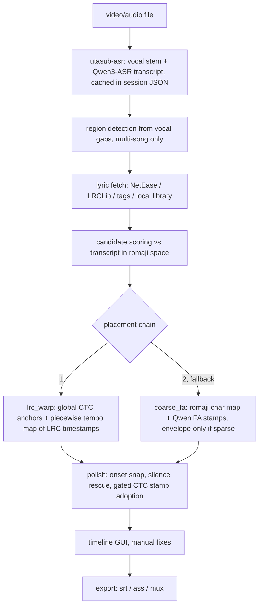

# utasub

<div align="center">

[](https://github.com/nnyj/utasub/stargazers)
[](https://github.com/nnyj/utasub/actions)

</div>

- Stamps official lyrics onto performance videos, outputs `.srt`/`.ass` subtitles
- Fetches lyrics from NetEase/LRCLib, aligns them to a cached ASR transcript with forced alignment and vocal-envelope snapping
- Timeline GUI for manual fixes, machine proposes, human picks and drags


## Features

- Lyric fetch from NetEase (primary), LRCLib, embedded container tags, and a curated local `.lrc` library
- Candidate ranking against the ASR transcript in romaji space (text + duration similarity)
- Credit-line cleanup via `lyrickit.classify_lines`/`filter_credit_lines`: strikes 作词/作曲/编曲 labels, watermarks, LRC headers
- Placement chain: LRC warp (piecewise tempo map) with coarse + forced-alignment fallback
- Qwen3-ForcedAligner word-level stamping with plausibility gates, degrades gracefully without GPU
- Multi-song mode: region detection from vocal gaps, setlist discovery (Wikipedia) or pasted setlist, order-aware DP matching
- MC detection: spoken intermission talk flagged from transcript text signals, excluded from lyric matching, exported as its own grey subtitle style
- PySide6 GUI: per-region lyrics picker, `Align > Paste setlist...` re-match, waveform timeline with draggable cues, onset snap, tap-sync, undo/redo
- Deterministic re-export from a session file, no network or re-alignment needed
- Output: `.srt` (plus `.ja.srt`/`.romaji.srt`), styled dual-line `.ass`, soft-sub mux into `.subbed.mkv`

## Usage

- Generate the ASR block first (once per file), then run the main tool:

```sh
utasub-asr concert.mkv            # transcribe on vocal stem, writes ASR into concert.utasub.json
utasub concert.mkv                # fetch, align, open GUI
utasub concert.mkv --multi-song   # concert with multiple songs
utasub concert.mkv --no-gui       # headless best-effort export
utasub concert.mkv --timeline     # reopen saved session, skip align
```

- `utasub.bat` accepts drag-and-drop and runs `--no-gui`

## CLI flags

| Flag                     | Default   | Description                                                        |
| ------------------------ | --------- | ------------------------------------------------------------------ |
| `--gui/--no-gui`         | auto      | GUI when a display is available                                    |
| `--multi-song`           | off       | region detection + per-song matching                               |
| `--providers`            | `NetEase` | comma-separated lyric sources                                      |
| `--fa/--no-fa`           | auto      | forced alignment, on when `torchaudio` or `qwen_asr` importable    |
| `--romaji/--no-romaji`   | on        | romaji subtitle track                                              |
| `--setlist/--no-setlist` | on        | setlist discovery in multi-song mode                               |
| `--setlist-file`         | none      | manual setlist text file, overrides discovery                      |
| `--mc/--no-mc`           | on        | detect spoken MC talk, exclude from matching, subtitle it verbatim |
| `--timeline`             | off       | open saved session directly, skip align                            |
| `--fresh`                | off       | bypass fetch cache                                                 |
| `--offset`               | `-0.2`    | SRT offset seconds, negative = earlier                             |
| `--lead`                 | `0.0`     | extra head start seconds                                           |

- `utasub-asr` flags: `--lang` (force language), `--small` (0.6B model), `--cpu`, `--no-stems` (transcribe full mix), `--overwrite`

## How it works



- ASR: `utasub-asr` runs Qwen3-ASR on a Mel-Band Roformer vocal stem, caches the transcript inside `<name>.utasub.json`, the core tool only reads it
- Candidate scoring: fetched lyric candidates are scored against the transcript in romaji space, credits stripped
- Placement runs per song as a strategy chain, first success wins: `lrc_warp` then `coarse_fa`
- Two aligners, one role each: a global CTC pass (torchaudio MMS_FA) stamps the anchors that pin the warp for `lrc_warp`, Qwen3-ForcedAligner gives the per-line stamps `coarse_fa` places from
- Without an aligner (`--no-fa`, no `torchaudio`, no GPU): `lrc_warp` cannot fit (no anchors), `coarse_fa` degrades to envelope-only
- Multi-song: detected regions are matched to the setlist by monotonic DP
- All state (candidates, cues, manual edits, offsets) lives in the session JSON, so export is deterministic and repeatable

## Glossary

- LRC: lyric file format with per-line timestamps (`[mm:ss.xx] line`), here always the studio recording's timings
- ASR: automatic speech recognition, audio in, text with rough segment times out
- FA, forced alignment: the inverse of ASR, the lyric text is already known, the model listens to the audio and measures when each token of it is sung
- FA stamp: aligner output aggregated per lyric line, one measured (start, end) pair plus a confidence
- Coarse map: rough per-line start from text matching alone, no model, used for candidate and region scoring
- Anchor: a (lyric line, audio time) pair the warp is fitted through, here every line the global CTC pass stamped
- CTC, connectionist temporal classification: the decoding scheme forced alignment rests on, the acoustic model scores every token's probability per audio frame, and the best monotonic path through that grid that spells the known text gives each token its time span
- Global CTC pass: one such path over a whole song's audio at once, every line lands in order and on the right repeat of a chorus
- Star token: a wildcard label in the target sequence that any frame may match, placed between lines so instrumental breaks and MC talk do not drag a lyric token onto them
- Confidence gate: drop the lowest-scoring tenth of lines by mean token log-prob, applied only where a stamp is used as a line's start directly
- Vocal stem: the separated vocals-only audio track (accompaniment removed)
- Envelope: loudness-over-time curve computed from the vocal stem, tells voiced from silent spans, used for placement sanity and end trimming
- Onset: sudden spectral-flux energy rise, a likely syllable/note start, snap target for line starts
- DP, dynamic programming: exhaustive-but-cheap optimization over ordered choices, used twice, changepoint search for warp segment boundaries, and monotonic region-to-setlist matching
- Warp: the fitted map from LRC time to live-audio time, piecewise linear, each piece is a tempo ratio plus offset

## Alignment algorithms

- LRC warp (`core/warp.py`, `core/place.py`):
  - Treats the studio LRC timestamps as a correct shape, models the live take as that shape shifted and stretched
  - Fits a monotone piecewise-linear map from LRC time to audio time, each piece has a tempo slope and offset
  - Piece boundaries are chosen by a changepoint dynamic program, a fixed penalty per break means it only splits when the split buys real accuracy
  - Discontinuous jumps (inserted/cut material) are only allowed where the audio is actually silent
- Anchors (`core/anchors.py`, `core/ctc_align.py`):
  - One global monotonic CTC pass stamps every line: torchaudio's MMS_FA acoustic model over the whole region span, targets are all lines' romaji tokens in order with a `<star>` wildcard between them (and at head/tail) to absorb intros, solos and MC talk
  - The single Viterbi path puts every line in order by construction, so a repeated chorus cannot be matched to the wrong occurrence
  - Confidence per line is its mean token log-prob. Anchors go to the warp fit ungated (the fit's own chain filters discard outliers); stamps used directly for placement are gated at the per-song 10th percentile
  - Emission is computed in 30s chunks with 1.5s of context per seam (self-attention is quadratic in frames), the alignment stays one pass over the concatenated emission
- Forced alignment (`core/fa.py`):
  - Qwen3-ForcedAligner gets known lyric text plus a padded audio window, returns per-token times mapped back to lines
  - Stamps discarded if the implied singing rate is implausible or the stamp drifts too far from its seed
  - Only the `coarse_fa` fallback uses it; the warp's anchors come from the CTC pass
- Coarse map (`core/align.py`):
  - A rough start time per lyric line derived from text matching alone, no FA model involved
  - ASR only times whole segments, so each character inside a segment gets an invented time by linear interpolation between segment start and end
  - Lyrics and transcript are romanized to character streams, `SequenceMatcher` finds matching runs, a lyric line starts at the interpolated time of its first matched character
  - `coarse_fa` strategy (the fallback when no warp fits): every line starts at its coarse-map time, then any line the FA model stamped (and that survived the gates) has its time replaced by the stamp
  - If FA stamped under half the lines the stamps are distrusted entirely, placement uses coarse-map times nudged onto voiced spans of the envelope (envelope-only)
- Placement polish (`core/place.py`):
  - Final starts get local corrections: snap to nearest strong spectral-flux onset, forward rescue out of silence, then adoption of the CTC stamps that passed the confidence gate (the same pass that gave the anchors, no second alignment)
  - An adopted stamp must also sit within 2s of the warped-and-snapped placement: the warp is fitted from these same stamps, so a stamp further out disagrees with every other stamp in the song (a line smeared across an instrumental)
  - Ends come from the LRC interval scaled by segment tempo, trimmed by envelope and the CTC line end, bounded by a chars-per-second rate guard

## Tests

- `pytest tests/` runs the synthetic suite, no media or network needed

## Install

```sh
pip install -e .          # core: cutlet, numpy
pip install -e .[gui]     # + PySide6
pip install -e .[asr]     # + qwen-asr, audio-separator (pulls torch)
```

- Requires Python 3.12+, `ffmpeg`/`ffprobe` on PATH
- [lyrickit](https://github.com/nnyj/lyrickit) and [romakit](https://github.com/nnyj/romakit) (credit cleanup, romanization) install automatically from GitHub; for development, a local `pip install -e path/to/lyrickit` afterwards overrides the git copy
- No local services or API keys needed, network use is limited to the lyric providers and the Wikipedia API
- Optional paths: curated lyrics library dir (provider config), stem model dir (`UTASUB_STEM_MODEL_DIR`, defaults to library cache)

## Credits

- [qwen-asr](https://github.com/QwenLM/Qwen3-ASR) : transcription and forced alignment
- [torchaudio MMS_FA](https://pytorch.org/audio/stable/generated/torchaudio.pipelines.MMS_FA.html) : global CTC anchor pass
- [audio-separator](https://github.com/nomadkaraoke/python-audio-separator) : vocal stem separation

## License

[MIT](LICENSE)
